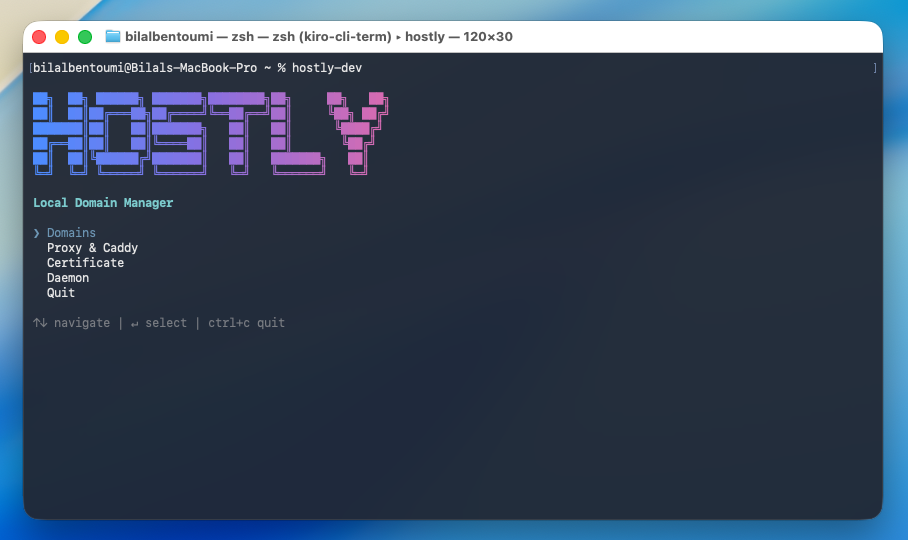

# hostly

> Interactive terminal app for managing local development domains on macOS and Linux.



`hostly` lets you map friendly hostnames like `myapp.local` to local ports and
serve them over trusted HTTPS — without hand-editing `/etc/hosts` or writing
Caddy config. It wires together two things for each domain you register:

- An `/etc/hosts` entry pointing the hostname at `127.0.0.1`.
- A [Caddy](https://caddyserver.com) reverse-proxy route to your app's port,
  with a locally-trusted certificate issued by Caddy's internal CA.

The result: `https://myapp.local` resolves to your dev server with a green
padlock, while the underlying app keeps running on a plain `localhost:PORT`.

## Requirements

- **Node.js >= 18**
- **[Caddy](https://caddyserver.com/docs/install)** installed and on your
  `PATH`. hostly drives Caddy through its admin API at `http://localhost:2019`.
- macOS (launchd) or Linux (systemd `--user`) for the optional boot daemon.
- `sudo` access — editing `/etc/hosts` and installing the CA into the system
  trust store require elevation. The interactive UI primes `sudo` on launch.

## Install

```bash
npm install -g hostly
```

## Usage

### Interactive UI

```bash
hostly
```

Launches a full-screen terminal UI. Navigate with the arrow keys, `↵` to
select, `esc` to go back, and `ctrl+c` to quit. The main menu has four areas:

- **Domains** — add, edit, and remove domains. A domain is a host
  (`myapp.local`), a target port, and a scheme (`http`, `https`, or `both`).
  Saving reconciles both `/etc/hosts` and Caddy.
- **Proxy & Caddy** — view admin-API reachability and active reverse-proxy
  routes, and re-sync routes from the saved registry.
- **Certificate** — trust or untrust Caddy's local root CA in the system trust
  store so browsers accept your HTTPS domains.
- **Daemon** — install or remove a boot-time service that re-applies your
  domains after Caddy restarts (see below).

### `hostly sync`

```bash
hostly sync
```

Re-applies every saved domain to Caddy, then exits. Caddy's admin-API config is
**not** persisted across restarts, so routes are lost whenever Caddy
(re)starts. `sync` restores them. It does not touch `/etc/hosts`, which already
survives reboots.

This is the command the boot daemon runs. Install the daemon from the
**Daemon** screen to have routes restored automatically at login/boot via
launchd (macOS) or a systemd user unit (Linux).

## How it works

- **Registry** — domains are stored as JSON in your platform config directory
  (resolved via [`env-paths`](https://github.com/sindresorhus/env-paths), e.g.
  `~/Library/Application Support/hostly/domains.json` on macOS). This is the
  source of truth that both `/etc/hosts` and Caddy are reconciled against.
- **/etc/hosts** — entries are written inside a managed
  `# Hostly Start` / `# Hostly End` block, leaving the rest of the file
  untouched. Writes fall back to `sudo cp` when the process lacks permission.
- **Caddy** — hostly loads a single `hostly` server (`:80`/`:443`) into Caddy's
  config via the admin API: a `reverse_proxy` route per domain, automatic
  HTTP→HTTPS redirects for `https` domains, and an `internal` TLS issuer for
  locally-trusted certificates.

## Development

Built with [Ink](https://github.com/vadimdemedes/ink) (React for the
terminal), [Zustand](https://github.com/pmndrs/zustand) for UI state, and
[meow](https://github.com/sindresorhus/meow) for argument parsing. Uses
[pnpm](https://pnpm.io).

```bash
pnpm install
pnpm build      # compile TypeScript to dist/
pnpm dev        # compile in watch mode
pnpm test       # lint (xo) + run tests (ava)
```

Run the local build directly with `node dist/cli.js`.

### Repository layout

```
src/
  cli.tsx          CLI entry — argument parsing and `sync` command
  app.tsx          Root component, screen router
  screens/         One component per UI screen (domains, proxy, certificate, daemon)
  libs/            Core logic: caddy, hosts, domains, daemon, registry
  components/       Shared UI (header, status line, key hints, forms)
  stores/          Zustand app store
  types/           Shared type definitions
website/           Next.js marketing site (deployed separately)
```

## License

MIT
